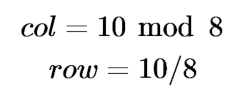

#othello.rb - A Ruby Othello game application

Object Library in Ruby for a 2 users to play a game of Othello on a terminal console.

(c)copyright 2019, Robert Batzinger, Payap University. All rights reserved. This source code is free for educational purposes. All inquiries should be addressed to robert&#91;b&#64;payap&#46;ac&#46;th.

##Overview

This program was developed as a working application to form the basis for subsequent assignments in the Payap University Computer Science course CS113 (Introduction to Object Oriented Programming). The application was designed as an RDOC file in order to generate documentation within the source code of the class library. As a console application, all i/o is done via STDIN and STDOUT data streams.

##Design Concepts

The application was designed for play on a terminal console such as the DOS prompt or a Bash shell. The following data structures were used. 

###Gameboard 

The individual units of an 8x8 Othello gameboard are rendered as a single dimensional array. Rows and columns are calculated using division and modulus, respectively. The Position 10 is in Column 2 and Row 1 as per the following equations: 

      +----++=======================================++
      |    ||       C o l u m n    N u m b e r      ||
      |Row |+----+----+----+----+----+----+----+----+|
      |Num || 0  | 1  | 2  | 3  | 4  | 5  | 6  | 7  ||
      +----++====+====+====+====+====+====+====+====++
      | 0  || 00 | 01 | 02 | 03 | 04 | 05 | 06 | 07 ||
      +----++----+----+----+----+----+----+----+----++
      | 1  || 08 | 09 | 10 | 11 | 12 | 13 | 14 | 15 ||
      +----++----+----+----+----+----+----+----+----++
      | 2  || 16 | 17 | 18 | 19 | 20 | 21 | 22 | 23 ||
      +----++----+----+----+----+----+----+----+----++
      | 3  || 24 | 25 | 26 | 27 | 28 | 29 | 30 | 31 ||
      +----++----+----+----+----+----+----+----+----++
      | 4  || 32 | 33 | 34 | 35 | 36 | 37 | 38 | 39 ||
      +----++----+----+----+----+----+----+----+----++
      | 5  || 40 | 41 | 42 | 43 | 44 | 45 | 46 | 47 ||
      +----++----+----+----+----+----+----+----+----++
      | 6  || 48 | 49 | 50 | 51 | 52 | 53 | 54 | 55 ||
      +----++----+----+----+----+----+----+----+----++
      | 7  || 56 | 57 | 58 | 59 | 60 | 61 | 62 | 63 ||
      +----++====+====+====+====+====+====+====+====++
  
###Line Direction
 
Line directions from a point are rendered as offsets to the array position of the next point on the line.  For example, a line going north from Position 58 through Positions 50, 42, and 34 would have the direction value of -8.

      +-------+-------+-------+ 
      | -9 NW | -8 N  | -7 NE |
      +-------+-------+-------+
      | -1 W  |   0   | +1 E  |
      +-------+-------+-------+
      | +7 SW | +8 S  | +9 SE |
      +-------+-------+-------+      

###Cell status

Each cell can only be in one of the following states:

* **:E** mpty: an unassigned cell
* **:P** ossible move: feasible moves for the current player
* **:B** lack: cells owned by Player Black
* **:W** hite: cells owned by Player White
	  
##Method of play

The idea is to capture the opponent's territory by selecting a blank space that would surround a series of the opponent's units. Play continues until there are no more areas to be conquered.

In the following example, there are five possible moves for the White player.

      -+---+---+---+---+---+-
       |[1]|[2]|[3]|[4]|[5]|
      -+---+---+---+---+---+-
       |   | B | B | B |   |
      -+---+---+---+---+---+-
       |   | W | W | W |   |
      -+---+---+---+---+---+-

By choosing Move #2, the White player will capture 2 pieces leaving the Black player with 3 possible moves.

      -+---+---+---+---+---+-
       |   | W |   |   |   |
      -+---+---+---+---+---+-
       |{1}| W | W | B |   |
      -+---+---+---+---+---+-
       |   | W | W | W |   |
      -+---+---+---+---+---+-
       |   |{2}|   |{3}|   |
      -+---+---+---+---+---+-

##Assignments

1. Modify the source code so that the program will allow users to play Othello on square board sizes between 4x4 and 20 cells.

2. Create an virtual player that will select each move at random from an list of permitted moves.

3. Create a run mode where virtual players will play against each other. 

4. Create a virtual player that will attempt to win using one of the following strategies:

     * **Edges and corner weighing:** Give highest priority to the corners, high priority to the outer margin, and decreasing priority down to the center.
     * **Most captured:** Give highest priority to the move that gives the most points captured or causes your opponent to loose.
     * **Maximize the number of cellss that would survive next opponent's turn:** Assume that the opponent always selects the move that captures the most pieces. Choose the move that leaves you the most pieces after your opponent's turn or causes the opponent to loose.
     * **Focus on upper left corner:** Give priority to the piece that is closest to the upper left corner.
     * **Even distribution on the board:** Give priority to placing pieces evenly around the board

		 
5. Run your virtual player against the random player for 20 times and determine how much your strategy improves winning over the random move player.	

6. Write a technical report in LaTeX to describe the function you created and the results of your study. 
